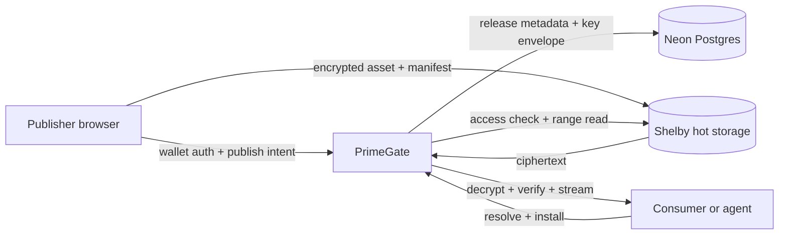

# PrimeGate

> A registry and access layer for versioned digital assets. Publishers upload once, define access, and give people or agents one stable install path.

PrimeGate is a working web, API, and CLI system for publishing digital assets as versioned releases. It gives every release a durable package identity, a manifest, an access offer, and a delivery path that clients can resolve without talking to storage directly.

Shelby provides the hot storage layer. PrimeGate owns the package model, wallet identity, access rules, release verification, and delivery boundary around it.

## Why PrimeGate exists

Object storage can hold a file, but it doesn't provide a package contract. A useful distribution system also needs:

- a stable publisher-scoped package name;
- immutable SemVer releases and release channels;
- a manifest with license, keywords, notes, and install metadata;
- free or paid access offers;
- a single resolve and install flow for web clients, CLIs, SDKs, and agents;
- a clear boundary between storage bytes and the application that is allowed to release them.

PrimeGate puts those pieces behind one registry. A publisher can upload an artifact, set the commercial terms, and share one link. A consumer can resolve the release, inspect its metadata, and install it through PrimeGate.

## The product boundary

| Layer | Responsibility |
| --- | --- |
| PrimeGate | Package identity, release metadata, offers, wallet sessions, entitlements, verification, and delivery |
| Shelby | Hot storage for encrypted artifact and manifest bytes |
| Neon Postgres | Catalog state, publish intents, key envelopes, offers, purchases, installs, reviews, and publisher usage |
| Aptos | Wallet authentication, Shelby registration, and paid listing settlement |



## How a release works

1. A publisher connects an Aptos wallet and signs a PrimeGate session.
2. PrimeGate checks the publisher's hybrid plan and reserves the requested publish bytes before creating an intent that binds the publisher, package slug, SemVer version, release channel, offer, and artifact attestation.
3. The browser encrypts the artifact and manifest into chunked AES-256-GCM ciphertext before uploading them to Shelby. The CLI follows the same format.
4. Shelby registers the encrypted blobs under opaque PrimeGate-controlled names. The original file name and package slug are kept in the manifest and catalog, not in the Shelby object path.
5. PrimeGate reads the uploaded ciphertext back from Shelby, decrypts it incrementally, and verifies the plaintext size and SHA-256 against the publish intent.
6. The API wraps the release key with `PRIMEGATE_CONTENT_KEY_SECRET` and stores the envelope with the release metadata in Neon. The raw content key is never stored in the catalog.
7. A consumer resolves the package through PrimeGate. The response includes the release, offer, access state, and install paths.
8. The download endpoint checks the release access rule, reads the required range from Shelby, decrypts the selected chunks, verifies the plaintext stream, and returns it through PrimeGate.

Publisher usage is recorded separately from package sales. The default plan includes a configurable monthly publish allowance and delivery allowance. Prepaid credits and subscription records have a place in the billing model, while the payment checkout rail remains an explicit deployment capability.

## Storage and access model

New releases use a 64-byte authenticated encryption header and 1 MiB chunks. Each chunk has its own derived nonce and authenticated data, so a large file can be verified and streamed without loading it into one memory buffer.

The storage boundary is deliberate:

- Shelby stores ciphertext, not usable release plaintext.
- PrimeGate controls the wrapped content key and the decryption path.
- The public catalog exposes package metadata and PrimeGate URLs, not raw Shelby credentials.
- Paid releases require a confirmed Aptos entitlement before the protected stream is opened.
- Downloads support single byte ranges with `206`, `Content-Range`, `Content-Length`, and `Accept-Ranges` responses. Invalid ranges return `416`.
- Public discovery only includes releases with PrimeGate encryption metadata. Older plaintext rows remain available to the publisher workspace for migration or republishing, but they are excluded from the public catalog.

This lets PrimeGate use Shelby for fast reads while keeping package access and release verification inside the application boundary.

## Product surfaces

### Web application

The web app provides:

- public discovery, search, package details, versions, and reviews;
- wallet connection and Aptos session authentication;
- browser publishing with direct encrypted Shelby upload;
- package resolution and protected installation;
- publisher release, purchase, install, and sales views.

### HTTP API

The API is the shared contract used by the web client and CLI.

| Route | Purpose |
| --- | --- |
| `GET /api/packages` | List public catalog packages |
| `GET /api/packages/:id` | Read package and release metadata |
| `GET /api/packages/:id/resolve` | Resolve access, offer, manifest, and install paths |
| `GET /api/packages/:id/manifest` | Read the authenticated release manifest |
| `GET /api/packages/:id/download` | Stream the authorized decrypted artifact |
| `GET /api/search` | Search packages |
| `POST /api/publish-intent` | Create an authenticated publish intent |
| `GET /api/publisher-billing` | Read the authenticated publisher's plan and usage |
| `POST /api/published-assets` | Finalize and verify a Shelby upload |

Authentication, entitlements, installs, purchases, sales, and publisher routes are exposed through the same API surface.

### CLI

The CLI supports the same package contract from a terminal:

```bash
pnpm primegate search "dataset"
pnpm primegate resolve <package-id>
pnpm primegate install <package-id> --output ./downloads
pnpm primegate verify <package-id>
pnpm primegate publish --manifest <path>
```

The CLI uses the release manifest and package id rather than reaching into Shelby directly. That keeps automation on the same access and verification path as the web app.

## Local development

PrimeGate uses `pnpm` and runs the Vite web app beside the Vercel-compatible API during local development.

```bash
pnpm install
cp .env.example .env.local
pnpm dev:local
```

Apply [`db/schema.sql`](db/schema.sql) to the Neon database before the first publish. [`db/seed.sql`](db/seed.sql) is intentionally empty of demo catalog rows. Publish real artifacts through PrimeGate instead of committing fixtures that look like products.

Required environment values:

| Variable | Used by |
| --- | --- |
| `DATABASE_URL` | Neon catalog, sessions, offers, entitlements, and release state |
| `PRIMEGATE_SESSION_SECRET` | Wallet session signing |
| `PRIMEGATE_PUBLISH_SECRET` | Publish intent attestation |
| `PRIMEGATE_CONTENT_KEY_SECRET` | Content-key envelope protection |
| `VITE_SHELBY_API_KEY` | Browser Shelby RPC requests |
| `VITE_SHELBY_RPC_BASE_URL` | Browser Shelby RPC base URL |
| `VITE_APTOS_WALLET_NAME` | Wallet adapter configuration |
| `VITE_PRIMEGATE_REGISTRY_ADDRESS` | Aptos registry address |

Optional values include `VITE_API_BASE_URL`, `LOCAL_API_PROXY_TARGET`, `PRIMEGATE_MAX_UPLOAD_BYTES`, `PRIMEGATE_FREE_PUBLISH_BYTES`, `PRIMEGATE_FREE_EGRESS_BYTES`, `PRIMEGATE_BILLING_PAYMENT_RAIL`, `SHELBY_API_KEY`, and `SHELBY_RPC_BASE_URL`.

`PRIMEGATE_CONTENT_KEY_SECRET` must be a stable high-entropy value. Rotating it without rewrapping stored envelopes makes existing encrypted releases unreadable.

## Verification

Run the local gates before pushing or deploying:

```bash
pnpm test
pnpm exec tsc --noEmit
pnpm build
pnpm lint
git diff --check
```

The live verification path should cover:

1. wallet authentication;
2. publish intent creation;
3. browser or CLI encryption;
4. Shelby upload and Aptos registration;
5. finalization and incremental hash verification;
6. public or entitlement-gated resolution;
7. full download hash comparison;
8. range download and invalid-range behavior.

## Deployment

The production app is deployed as a Vercel project with the web frontend and API functions in one release. Set the production environment values, then deploy with:

```bash
pnpm exec vercel --prod --yes
```

The health endpoint reports the active network and whether the database, registry, session, publish, encryption, and Shelby configuration are reachable:

```bash
curl https://primegatelive.vercel.app/api/health
```

The current environment is connected to Aptos testnet and Shelby testnet. Mainnet configuration is a deployment change, not a different package or storage model.

## Repository layout

```text
api/                  Vercel API functions and request routers
api/_lib/             Catalog, auth, publishing, payment, Shelby, and encryption services
src/pages/            Public, publisher, and workspace routes
src/components/       Shared UI and package presentation
src/hooks/            Wallet, catalog, publishing, and route-data hooks
src/lib/              Package model, registry client, encryption, and Aptos helpers
src/cli/              PrimeGate CLI
db/                   Neon schema and deployment-safe seed file
artifacts/             Usable local artifacts for release verification
review/                Integration and release review notes
```

## Operational direction

The core release path is live and verified. The next operational work is focused on scale and recovery:

- durable resume for an upload interrupted after Shelby registration;
- release migration and key rotation tooling;
- retention-aware storage cost reconciliation for large artifacts;
- publisher quota, prepaid credit, and subscription checkout;
- sponsored Shelby registration so publishers can use PrimeGate without funding protocol fees themselves;
- stronger publisher verification and package provenance;
- mainnet Aptos and Shelby configuration with production monitoring.

Those changes build on the same contract: PrimeGate owns the release and access policy, while Shelby handles the hot bytes.
